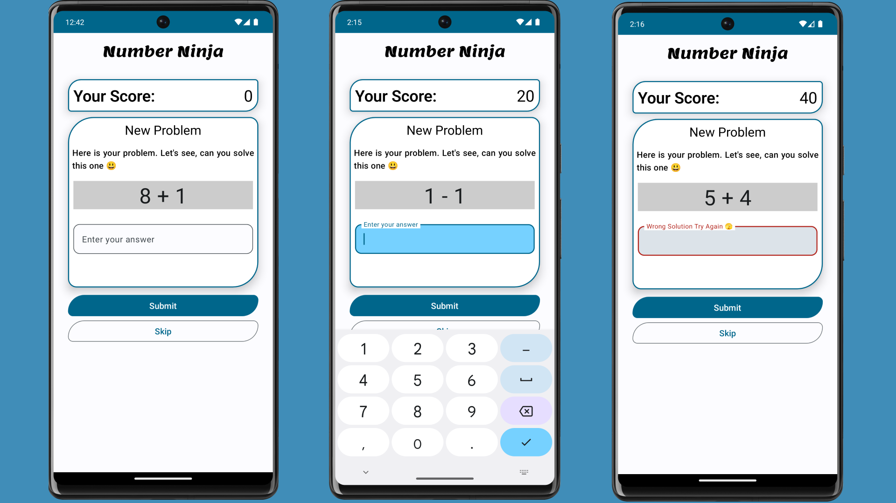

## Number Ninja
Number Ninja is an engaging game designed for children, where users must answer randomly generated mathematical questions. If the answer is correct, 20 points are added to the user's score; otherwise, an error message is displayed. The app is built with Jetpack Compose and adheres to the MVVM architecture.
## Screenshots

